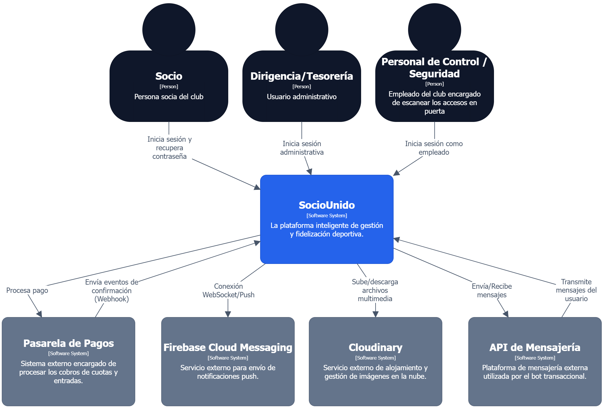
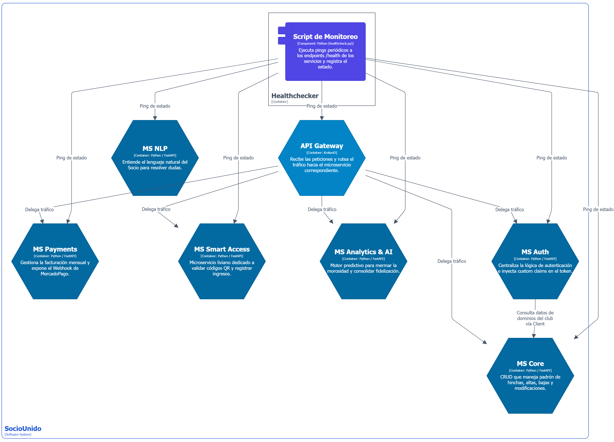
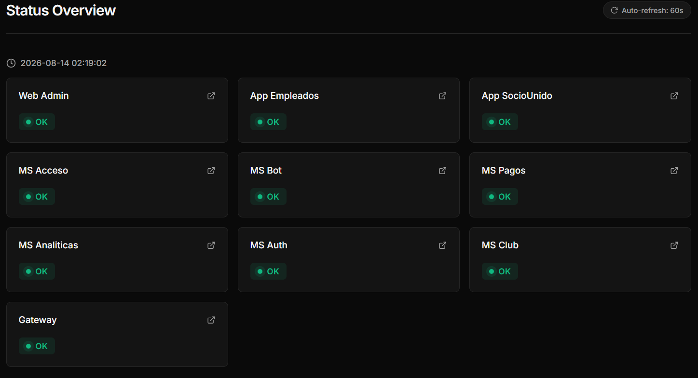

# 🏗️ Arquitectura, diagramas e interfaz

A continuación se presentan los diagramas de arquitectura basados en el modelo C4 para entender la estructura, dependencias y el flujo de información de esta implementación en particular. Además de la interfaz de monitoreo de los microservicios, gateway y plataforma web.

## Nivel 1: Contexto

## Nivel 2: Contenedores

## Nivel 3: Componentes

## Interfaz de monitoreo

